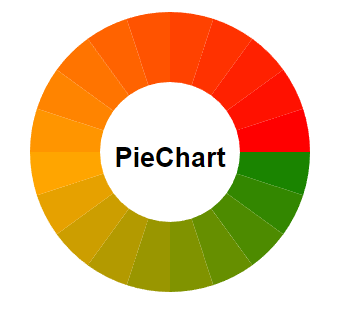

## PieChart Component

### Description
The PieChart component is a Vue.js-based SVG pie chart that allows you to visualize data in a circular format. This component provides an intuitive way to represent data distribution and is customizable to suit various design preferences.

### Status
**Under Development**: This component is currently under development and may undergo changes or updates. Use with caution in production environments.

### Props
- **title**: The title of the pie chart.
- **font**: An object defining the font properties for text displayed in the chart. It includes `fontFamily`, `fontSize`, `fontWeight`, and `fill`.
- **width**: The width of the SVG element containing the pie chart.
- **height**: The height of the SVG element containing the pie chart.
- **outerRadius**: The outer radius of the pie chart.
- **innerRadius**: The inner radius of the pie chart.
- **data**: An object containing the data to be visualized in the pie chart.
- **sliceColors**: An array of colors used to fill the pie chart slices.

### Example
```html
<PieChart
  :title="'Sales Distribution'"
  :font="{ fontFamily: 'Arial', fontSize: '16px', fontWeight: 'bold', fill: '#333' }"
  :width="400"
  :height="400"
  :outerRadius="150"
  :innerRadius="75"
  :data="{
    '2024-02-22': 100,
    '2024-02-21': 80,
    '2024-02-20': 120,
    '2024-02-19': 90,
    '2024-02-18': 70,
    '2024-02-17': 110,
    '2024-02-16': 85
  }"
  :sliceColors="['#ffcc66', '#99ccff', '#ff9999', '#99ff99', '#ff66ff', '#66cc99', '#ccccff']"
/>
```
### Images


### License
This project is licensed under the [MIT License](https://github.com/MartvdZalm/PieChart/blob/master/LICENSE).

### Contact
You can contact me for any questions, feedback, or collaboration opportunities:

- **Email**: [martvanderzalm@gmail.com](martvanderzalm@gmail.com)